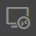
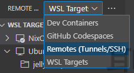
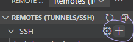
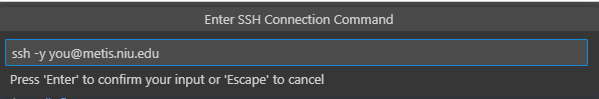
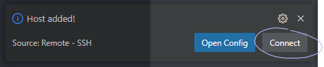
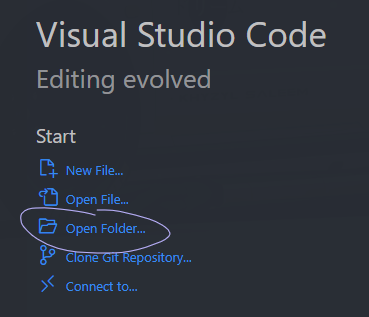

# 1.2. Remote Workspaces in VSCode
<small>[*Associated CRCD Documentation*](https://crcd.niu.edu/crcd/current-users/getting-started/login-to-metis.shtml#editfiles)</small>

<small>*If you encounter issues, see the [official VSCode documentation](https://code.visualstudio.com/docs/remote/ssh)!*</small>

This guide is primarily applicable to Windows users, as the graphical integrated development enviroment it provides can make development much easier.

However, development on Metis is also possible and easy, as the majority of popular terminal-based editors are preinstalled on the login nodes:
* [Vi and Vim](https://www.vim.org/)
* [GNU Emacs](https://www.gnu.org/software/emacs/)
* [GNU nano](https://www.nano-editor.org/)

Similarly, the two most popular build tools are also installed:
* [GNU Make](https://www.gnu.org/software/make/)
* [CMake](https://cmake.org/)

## Installing VSCode and Remote Explorer
If you haven't already, first install [Visual Studio Code](https://code.visualstudio.com/). Note that Visual Studio Code and Visual Studio are *not* the same thing.

Next, navigate to the **Extensions** tab, and install the **Remote Development** extension by Microsoft. Then, restart VSCode.

## Adding Metis as a Remote Host

On the left panel, click on **Remote Explorer**:

Then, make sure you are in the **Remotes (Tunnel/SSH)** section:

Next, create a new SSH host:

This will prompt you for your SSH command. It is slightly easier to add the `-y` flag, as seen below:

It will then as you where to save your SSH configuration. It doesn't really matter which you pick, but the option in your `Users` folder is ideal.

After choosing a location, you'll see a prompt in the bottom right, on which you should click **Connect**:

This will open a new VSCode window, where you are now connected to Metis graphically!

## Adding a Folder

When this new window opens, you can click the **Open Folder** option to choose your first folder:

It's recommended you start with `/home/you`.

If you've been allocated a project, you may also want to open `/lstr/sahara/your_project`.